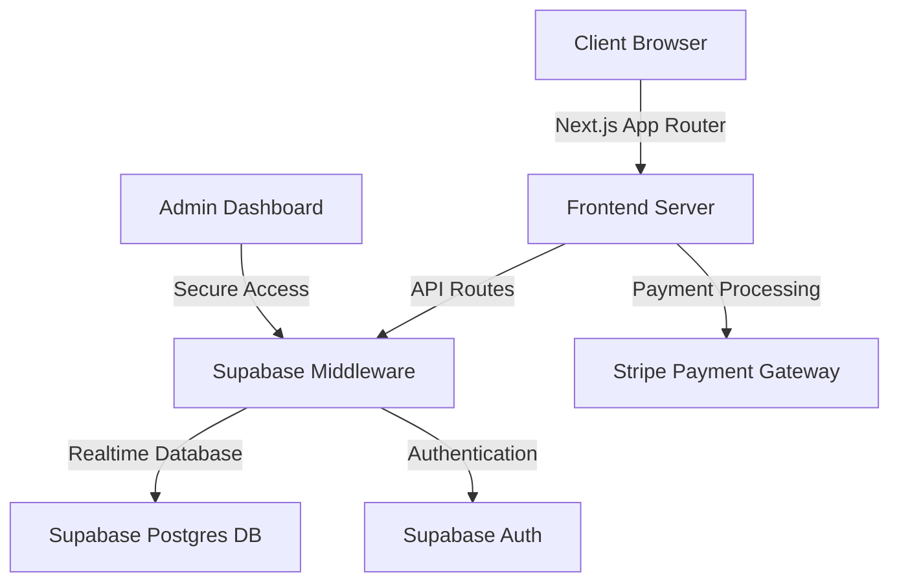

# System Architecture

## High-Level Architecture Diagram



## Component Breakdown

### Frontend (Next.js)

- **Pages/Routes**
  - Home/Menu
  - Order Customization
  - Cart
  - Checkout
  - Order Tracking
  - User Profile
  - Admin Dashboard

### Backend (Supabase)

- **Database Tables**
  - users
  - products
  - categories
  - orders
  - order_items
  - reviews

### Authentication

- Email/Password
- Social Login (Google, Apple)
- Role-based Access Control

### External Integrations

- Stripe (Payments)
- Google Maps (Delivery Tracking)
- Sendgrid/Resend (Notifications)

## Security Considerations

- JWT Authentication
- Row Level Security (RLS)
- HTTPS Everywhere
- Input Validation
- Rate Limiting

```

